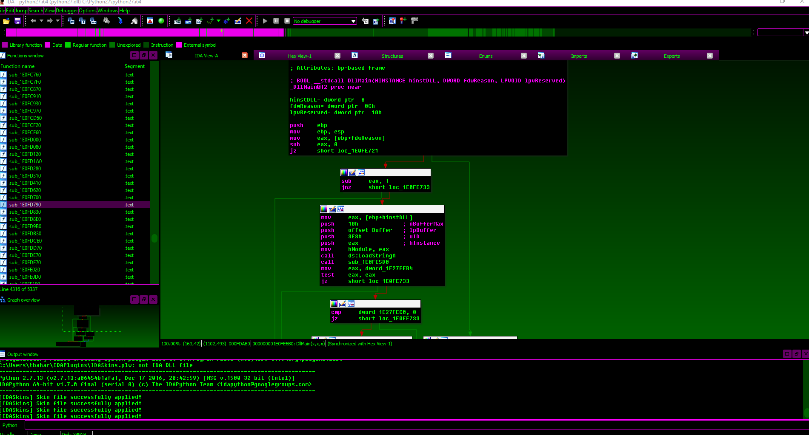

# RECON 2017
RECON 2017 IDA skin & color scheme

## Installation

### Color Scheme

In IDA, go to `Options->Colors->Import` and select the color scheme (`RECON2017-idacolors.clr`).

If you don't like menus, hold <kbd>Alt</kbd> and click <kbd>o</kbd>,<kbd>c</kbd>,<kbd>i</kbd>.

### Skin

The skin is powered by [IDASkins](https://github.com/zyantific/IDASkins) and based on its dark scheme.

Follow the installtion instructions [here](https://github.com/zyantific/IDASkins).
